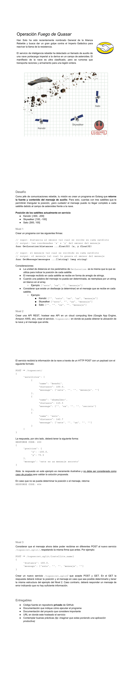

# MercadoLibre Technichal Challenge

My solution to Mercadolibre's Java technical challenge...with a twist.

## Execution
In [this address](https://melichallenge-kkhnr7cx4q-rj.a.run.app) you can send requests and try the app (altough it's possible that unauthenticated requests are not allowed by the time you try this due to Google Cloud's quotas, just contact me and I'll enable it in a heartbeat)

## Implementation
To implement this app in your own Google Cloud environment, please
follow [this guide](https://cloud.google.com/run/docs/continuous-deployment-with-cloud-build).

Don't forget to set the [maximum number of container instances to 3!](https://cloud.google.com/run/docs/configuring/max-instances)

## Architecture
The app is entirely built on Spring and Java 11 and it's currently running in a Google Cloud Run environment with continuous deployment, default settings and a
limit of 3 instances per container. This environment configuration allows up to 2
million service calls per month with no charge.
The instance limit is due to the fact that in a real scenario there could be 3 simultaneous messages from the satellites at any given time. If for any reason the server has to handle more than 3 messages at a given time, it starts a new instance so that the requests are processed independently.

The app has 1 Spring service and 2 controllers:
* `TopSecretController` (handles `topsecret` service)
* `TopSecretSplitController` (handles `topsecret_split` service)

The service, `SplitSatelliteMessagesProcessorService`, is a singleton Spring bean that manages the TopSecretSplitController's
functions.

There's also a bean that handles the ResourceBundle defined in `messages_en_US.properties`

The main idea for both services is to parse the request's parameters -validating them in the process- to a common entity (RequestObject) that contains the messages from the three satellites and from then on process the information and figure out where the message comes from and the message itself, and finally sending a response with the results.

This is easily done in the `topsecret` service, because the payload should contain the messages from the three satellites at the same time. But what about the `topsecret_split` service? In that case we parse and validate each satellite's message in the controller to a common entity: `SatelliteMessage`, but the entity itself (`RequestObject`) is finally built in the service bean `SplitSatelliteMessagesProcessorService`.

### SplitSatelliteMessagesProcessorService
The service contains a field which is a list of `SatelliteMessage` and also an async function that creates the `RequestObject` from the three individual messages...if the three messages arrive within a property-set-timeout (but doesn't wait if the three messages arrive at the same time)

The controller `TopSecretSplitController` interacts with the service bean when it **synchronously to the list** adds a  `SatelliteMessage` to said list: if it doesn't have any messages, it starts the async function and returns the `CompletableFuture<ResponseEntity>` instance to the controller so it can wait until the result is ready while it doesn't block other requests from being processed! The async function then waits until timeout or until it's notified that the three messages are there and continues from then on, **synchronously to the list** (because we don't want another message to be added while we're working with it), creating the `RequestObject` and so on.

## The basic functions
Here's where the twist comes in. This part of the challenge was a bit confusing: as stated by the document (see below), the functions `GetMessage()` and `GetLocation()` are supposed to receive just ONE `String[]` message and ONE `Double` distance respectively which didn't make sense to me since it would be impossible to calculate a position from just one point (x,y) and a distance from that point or a message with just one `String[]`.
To make matters even more confusing, the document states that the names of the function parameters are in plural, so I decided to make the functions receive a list of messages and an array of distances respectively. Keep in mind that the array of distances has been ordered alphabetically at the time of its creation so it's **important to keep that order** (Kenobi, Sato, Skywalker).

We calculate the location of the spaceship given 3 points (x,y) and 3 distances. The mathematical idea here is to create 3 circumferences centered in a specific x,y coordinate (each for every satellite) with their corresponding radiuses and find if they intersect and where.

To recover the message, we find the array that has the longest lenght from the first word until the end creating a "negative array index". We then iterate each word in every array starting from the negative index until the end and we add each word to a HashSet. When this HashSet has 1 or 2 different values, we understand that either all the words are the same in that index or that there's at least a blank space and at least one word so we delete the blank space and return the word. Otherwise it's not possible to decode the word, hence we return an empty string.

## The project requirements:
